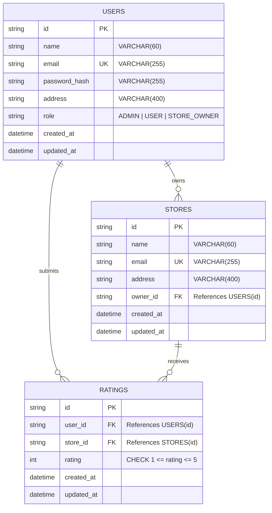

# Phase 1: Architecture, Technology Stack & Database Design

## 1. Architectural Overview
The application follows a clean 3-tier monolithic decoupled architecture:
1. **Frontend Presentation Layer**: Modern React single-page application built with Vite, React Router v6, Lucide icons, and Vanilla CSS with CSS custom properties (design tokens).
2. **Backend Application Layer**: Express.js RESTful API structured cleanly into routes, controllers, middleware (auth, RBAC, validation, rate-limiting, error handling), and database service access.
3. **Data Persistence Layer**: Relational Database schema implemented via Prisma ORM with support for PostgreSQL, MySQL, and SQLite (for zero-configuration local evaluation), plus native SQL DDL migration scripts.

---

## 2. Technology Stack Selection

| Component | Technology | Rationale |
| :--- | :--- | :--- |
| **Backend Framework** | Node.js + Express.js | High performance, lightweight REST API, standard middleware ecosystem. |
| **Language** | JavaScript / ES Modules | Clean modern JavaScript modules with high compatibility and portability. |
| **ORM / Query Engine** | Prisma ORM | Strong schema typing, automatic migrations, relational integrity, zero-config SQLite support for seamless evaluator runs with one-click PostgreSQL/MySQL switch. |
| **Authentication** | JWT (JSON Web Tokens) + Bcrypt | Stateless authentication with secure salt rounds (10), role claims, and authorization middleware. |
| **Frontend Framework** | React 18+ via Vite | Lightning-fast HMR, component modularity, modern React hooks (`useContext`, `useReducer`, `useEffect`). |
| **Styling** | Vanilla CSS Design Tokens | Maximum control, sleek glassmorphism, responsive grid/flexbox layouts without bloated CSS dependencies. |
| **Testing** | Node.js Test Runner / Vitest / Supertest | Fast automated testing of authentication, CRUD APIs, rating uniqueness, and edge cases. |

---

## 3. Relational Database Schema Design (ERD & Constraints)

### Entity Relationship Diagram

### Table Specifications & Integrity Rules

#### 1. `users` Table
- `id`: UUID / CUID string primary key.
- `name`: VARCHAR(60), NOT NULL. Check length between 20 and 60 chars.
- `email`: VARCHAR(255), NOT NULL, UNIQUE. Indexed for fast auth lookup.
- `password_hash`: VARCHAR(255), NOT NULL (salted bcrypt hash).
- `address`: VARCHAR(400), NOT NULL.
- `role`: VARCHAR(20), NOT NULL, DEFAULT `'USER'`. Allowed values: `'ADMIN'`, `'USER'`, `'STORE_OWNER'`.
- `created_at`: TIMESTAMP WITH TIME ZONE DEFAULT NOW().
- `updated_at`: TIMESTAMP WITH TIME ZONE DEFAULT NOW().

#### 2. `stores` Table
- `id`: UUID / CUID string primary key.
- `name`: VARCHAR(60), NOT NULL. Check length between 20 and 60 chars.
- `email`: VARCHAR(255), NOT NULL, UNIQUE.
- `address`: VARCHAR(400), NOT NULL.
- `owner_id`: UUID string nullable foreign key referencing `users(id)` ON DELETE SET NULL.
- `created_at`: TIMESTAMP WITH TIME ZONE DEFAULT NOW().
- `updated_at`: TIMESTAMP WITH TIME ZONE DEFAULT NOW().
- Index on `(name)`, `(address)`, `(owner_id)`.

#### 3. `ratings` Table
- `id`: UUID / CUID string primary key.
- `user_id`: UUID string foreign key referencing `users(id)` ON DELETE CASCADE.
- `store_id`: UUID string foreign key referencing `stores(id)` ON DELETE CASCADE.
- `rating`: INTEGER NOT NULL. Value must satisfy `1 <= rating <= 5`.
- `created_at`: TIMESTAMP WITH TIME ZONE DEFAULT NOW().
- `updated_at`: TIMESTAMP WITH TIME ZONE DEFAULT NOW().
- **Unique Constraint**: `UNIQUE(user_id, store_id)` ensuring a user can rate a given store exactly once (or update their existing rating).
- Indexes on `(user_id)`, `(store_id)`.

---

## 4. API Endpoints Specification

### Authentication & Account
- `POST /api/auth/signup`: Normal user registration (Name, Email, Address, Password).
- `POST /api/auth/login`: Unified login for all roles. Returns JWT + user profile.
- `GET /api/auth/me`: Returns current authenticated user context.
- `PUT /api/auth/change-password`: Update current password with verification.

### System Administrator
- `GET /api/admin/dashboard`: Metrics summary (total users, total stores, total ratings, role distribution, recent activity).
- `GET /api/admin/users`: List users with search (`search`), filters (`role`), and sorting (`sortBy`, `order`). Includes store rating if user is a store owner.
- `POST /api/admin/users`: Create any user (Admin, Store Owner, Normal User).
- `GET /api/admin/users/:id`: Get single user profile with owner store stats.
- `POST /api/admin/stores`: Create new store with name, email, address, and optional owner assignment.
- `GET /api/admin/stores`: List stores with owner details, ratings count, and average score.

### Stores & Ratings (Normal User & Public)
- `GET /api/stores`: List stores with search (`q`), sorting (`sortBy=name|rating|address`, `order=asc|desc`), pagination, and logged-in user's submitted rating.
- `GET /api/stores/:id`: Detailed store profile with rating distribution and user rating.
- `POST /api/stores/:id/ratings`: Submit rating (1 to 5). Upserts if rating already exists.
- `PUT /api/stores/:id/ratings`: Modify existing rating (1 to 5).

### Store Owner
- `GET /api/owner/dashboard`: Owner's store statistics (average rating, total ratings, rating breakdown 1 to 5).
- `GET /api/owner/ratings`: Paginated, sortable list of customers who rated their store (user name, email, rating, date).
